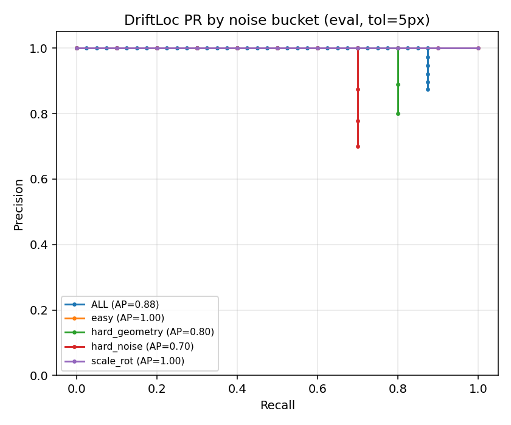

# Drift-Sense

> Given a 100× / 1 nm/px reference patch (1000×1000) and a 10× / ~10 nm/px search image (1000×1000), output the center `(x, y)` of the reference inside the search image. Tie-break: closest to `(500, 500)`.


---

## Our Solution — Three Stages

The main challenge is that DRAM contains many repeated structures. When the reference patch is searched inside the larger search image, several different DRAM cells can look very similar.

A simple template-matching method can therefore find a location that looks correct but actually belongs to another repeated cell. Our solution handles this in three steps:

**Find several possible locations → decide which one is correct → refine the final location.**

### Stage 1 — Propose: Find the Most Likely Locations

First, we use **ZNCC (Zero-Normalized Cross-Correlation)** to compare the reference patch with different parts of the search image.

We do not assume that the search image is exactly 10× larger or perfectly aligned. The actual scale can vary slightly and the image can have a small rotation.

So we test:

- **5 scale values:** 9.0, 9.5, 10.0, 10.5, 11.0
- **5 rotation values:** −2°, −1°, 0°, +1°, +2°

This gives **25 different matching searches**.

For each search, ZNCC produces a score at different locations. A high score means that the reference and that part of the search image look similar.

We then:

1. Find the strongest local peaks from all 25 searches.
2. Combine the peaks into one list.
3. Remove candidates that are too close to each other.
4. Keep the **top 20 candidate locations**.

Why not simply take the highest ZNCC score?

Because DRAM is repetitive. The highest score can belong to a different but visually similar DRAM cell. Instead of making this decision immediately, we keep several strong candidates.

**Result:** up to 20 possible locations are passed to Stage 2. The correct location is among these candidates about **90% of the time**.

### Stage 2 — Rank: Decide Which Candidate Is the Real Match

At this point, we have several locations that all look similar to the reference.

This is where the **CNN verifier** is used.

For every candidate, we take:

- A **128×128 crop** around that candidate from the search image
- The corresponding reference/template information
- Three additional values:
  - ZNCC score
  - Scale ratio
  - Rotation angle

The image information is provided to the CNN as a **2-channel 128×128 input**, together with the three numerical features.

The CNN then gives each candidate a score representing how likely it is to be the correct match.

An important part of training is the use of **hard negatives**.

Instead of using completely unrelated images as negative examples, we use the other high-scoring ZNCC candidates from the **same search image**.

This is important because those candidates are exactly the difficult cases: they are usually other repeated DRAM cells that look almost identical to the correct one.

So the CNN learns the actual problem we care about:

> **Which of these visually similar DRAM cells is the one that produced the reference patch?**

The CNN is therefore **not searching the entire image**. ZNCC has already done the search. The CNN only has to choose between the most promising candidates.

### Stage 3 — Refine: Get the Final Coordinate

After the CNN ranks the candidates, we select the best one.

However, the problem specification also defines what to do when multiple locations are almost equally plausible.

If several candidates have verifier scores within **0.05 of the best score**, we use the required tie-break rule:

> Choose the candidate closest to the center of the search image, `(500, 500)`.

Finally, we improve the coordinate beyond the integer pixel location.

ZNCC initially gives us an integer peak such as:

```text
x = 844
y = 286
```

We then fit a 1D parabola around that peak on the ZNCC map. That gives a small fractional offset, so the printed result can be:

```text
844.38 285.63
```

If `verifier.pt` is missing, the pipeline falls back to ZNCC + sub-pixel and still prints `x y`. If no ZNCC peaks are found at all, it prints `500 500`.

---

## Clone & Install

```bash
git clone https://github.com/Jaswanthj006/Semicon-Submission.git
cd Semicon-Submission
pip install -r requirements.txt
```

Python 3.10+ · Windows / Mac · GPU optional (CUDA / MPS / CPU)

Weights ship in `model/verifier.pt` — no training needed.

---

## Test on Your Dataset

**One pair:**

```bash
python localize.py --reference /path/to/REF.png --search /path/to/SEARCH.png
```

Prints one line: `x y`

**Batch (bash):**

```bash
for f in reference/*.png; do
  python localize.py --reference "$f" --search "search/$(basename "$f")"
done
```

**Batch (Windows):**

```bat
for %f in (reference\*.png) do python localize.py --reference "%f" --search "search\%~nxf"
```

**Smoke test on shipped pair:**

```bash
python localize.py --reference dataset/reference/00000.png --search dataset/search/00000.png

```

RGB optical PNGs work with the same command — loaded as grayscale internally.

---

## Generate Dataset & Test

One command builds reference + search + manifest with ground truth:

```bash
python generate_dataset.py --num-samples 100 --split test --output-dir ./output --seed 2026
```

Then score the model on it:

```bash
python train.py stage3 --data output --out model --split test
```

RGB optical bonus (does not overwrite `dataset/`):

```bash
python generate_dataset.py --num-samples 20 --split optical --output-dir ./dataset_optical --seed 99 --optical
```

---

## Results

| Split | n | pass@5 | pass@2 | pass@1 | median | time |
|---|---|---|---|---|---|---|
| **eval** | 40 | 0.875 | 0.85 | 0.625 | 0.66 px | 0.54 s |
| **test** | 250 | 0.856 | 0.844 | 0.684 | 0.64 px | 0.54 s |

Per bucket (eval): easy **1.00** · scale_rot **1.00** · hard_geometry **0.80** · hard_noise **0.70**

---

## Noise — What & Why

The search image is intentionally varied to represent different acquisition conditions. These effects are used to test whether the matcher can still locate the same DRAM structure when the image quality or appearance changes.

| Artifact | Why we add it | Citation |
|---|---|---|
| Poisson shot noise | Represents variation caused by electron-dose statistics | Joy 1995 |
| Detector Gaussian | Represents SEM electronics and detector noise | Timischl 2015 |
| Raster shear + jitter | Represents scan drift during acquisition | Jones & Nellist 2013 |
| Charging streaks | Represents local charging effects on the sample | Cazaux 2004 |
| Salt-and-pepper | Represents isolated pixel-level defects | — |
| Scale 9–11, rot ±2° | Tests small changes in effective scale and orientation | Problem statement |

Speckle, barrel distortion, and vignette are deliberately **OFF**. They are not required for the intended acquisition model and would introduce additional image distortions that are outside the main problem we are trying to solve.

The goal is to keep the underlying DRAM structure the same while changing how it appears in the search image.

Full details: `references/CITATIONS.md`

---

## Failure Mode & How We Addressed It

**What fails:** wrong DRAM period — the matcher can select a look-alike cell instead of the correct one, resulting in an error of ~100–600 px.

**Why:** at 10 nm/px, DRAM contains repeated structures that can produce very similar ZNCC scores at different locations.

**How we addressed it:**

- Stage 2 CNN trained with other ZNCC peaks as **hard negatives** (the exact aliases that cause failures)
- Spec tie-break picks the candidate nearest to (500, 500) among near-tied scores
- Reduced pass@5 failures from **~45%** (ZNCC alone) to **~12.5%** (with verifier)

Remaining misses (5 out of 40 eval): IDs `00025`, `00027`, `00029`, `00032`, `00035`. Overlays in `results/failures_eval/`.

---

## Evaluation Graph



Precision vs recall at different error thresholds, broken down by noise bucket.
